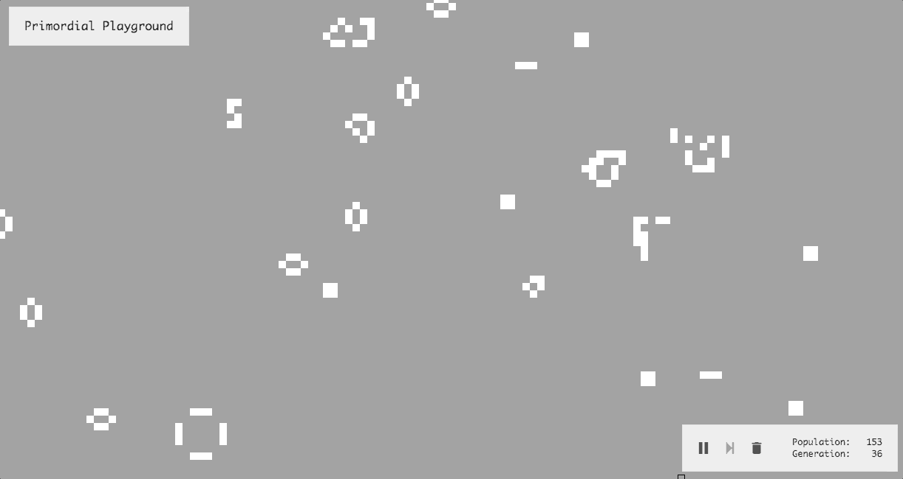

# [Primordial Playground][primordial-playground]

The Primordial Playground is a colorful, interactive [Game of Life][conways-gol-wiki] simulator, built with pure JavaScript, HTML, and CSS.

## Features

Pause, play, step-through, and speed-adjust the simulation and manually manipulation cell statuses in real simulation time, as well as...

drop pre-designed patterns and creatures on the grid, ...


alter life/death rules for some pretty interesting effects, ...


and adjust the colors, with included presets.


## Implementation

### Technologies

This simulation is built using purely ["Vanilla JavaScript"][vanilla-js] with the help of [webpack][webpack] and [Babel][babel]. The rest of the interface is built with HTML5 and CSS, with the help of [Sass][sass] for the SCSS compilation. It's hosted courtesy of [GitHub Pages][gh-pages]

### Technical Challenges

Using [simulation][simulation-code], [interface][interface-code], and [cell][cell-code] models, a large degree of interactivity is achieved.

#### Cell Updating

The largest challenge faced with building this simulation was understanding the timeline events that have to occur for the cellular automata to update correctly each step. The original implementation employed only a single update loop for the cells, meaning each cell was determining its following generation's status based on the current state of its neighbors.

```JavaScript
// lib/cell.js

update() {
  // Count surrounding living cells
  const aliveNeighbors = this.neighbors.filter(cell => cell.alive).length;

  // Advance to next generation
  this.alive = this.willLive;   // <-- wrong

  // ...
  // Determine next generation status and store in `this.willLive`
  // More update logic
  // ...
}
```

The problem here is that cells would be asking for their neighbors' status, and while the cells that had already been updated had the correct status, any cell that had not had its update method run would report wrongfully.

To solve this problem, an additional cell-comprehensive loop had to be introduced in order to advance _all_ the cells to their next status before doing any processing:

```JavaScript
// lib/simulation.js

update(fromClick = false) {
  // Advance cell states
  if (!fromClick) {
    this.cells.forEach(cell => cell.step());
    this.generation++;
  }

  // Update cells
  this.population = 0;
  this.cells.forEach(cell => {
    cell.update(fromClick);
    if (cell.alive) this.population++;
  });
}
```

```JavaScript
// lib/cell.js

update(fromClick = false) {
  // Count surrounding living cells
  const aliveNeighbors = this.neighbors.filter(cell => cell.alive).length;

  // NOTE: No more cell advancement here

  // ...
  // Determine next generation status and store in `this.willLive`
  // More update logic
  // ...
}
```

#### Browser Performance

The original implementation of the simulation engine for this project resulted in inefficient and overall "laggy" performance within the browser. This was due to a couple things:
- the render loop was being run via a `setInterval()`, meaning it would run regardless of browser/tab focus.
- far too many actions were being run in the update loops in an attempt to make the simulation engine general-purpose.

The first problem was easily resolved by utilizing `requestAnimationFrame()` to run the draw loop. Using this allows the browser to take care of a few things to improve performance, including only running the render updates when the tab is in focus.

The second problem was addressed by refactoring the render/update engine. The first engine had set been set up to handle several extra events, including grid dragging and key inputs:

```JavaScript
// src/js/engine.js on old commit

// Set up key status tracking
this.downkeys = new Set;
this.body.addEventListener('keydown', event => {
  this.downkeys.add(event.keyCode);
});
this.body.addEventListener('keyup', event => {
  this.downkeys.delete(event.keyCode);
});

// Set up mouse status tracking
const handleMouseMove = ({ clientX, clientY }) => {
  this.mousePosition = new Pair(clientX, clientY);
  const mouseDelta = this.mouseDownPosition.delta(this.mousePosition);
  this.eachDragObject(mdo => {
    mdo.position = mdo.mouseDownPosition.offset(mouseDelta);
  });
};

this.body.addEventListener('mousedown', ({ clientX, clientY }) => {
  this.body.addEventListener('mousemove', handleMouseMove);
  this.mouseDownPosition = new Pair(clientX, clientY);
  this.eachDragObject(mdo => {
    mdo.mouseDownPosition = mdo.position;
  });
});

this.body.addEventListener('mouseup', ({ clientX, clientY }) => {
  this.body.removeEventListener('mousemove', handleMouseMove);
  this.mouseDownPosition = new Pair(clientX, clientY);
  this.mouseDelta = new Pair;
});
```

It was soon determined that:
- keyboard input tracking was unnecessary
- draggability
  - was not necessary for an enjoyable user experience
  - detracted from user experience in terms of performance

so, a pruned down version of the `engine.js` was written in the form of `simulation.js`.

## Future Improvements
- [ ] Add rule presets
- [ ] Add dynamic board expansion
- [ ] Add online support
- [ ] Add other types of cellular automata
- [ ] Allow users to save board, patterns, and color schemes

## Credits
Step icon made by [Dave Gandy](https://www.flaticon.com/authors/dave-gandy) from [www.flaticon.com](https://www.flaticon.com/)

Trash icon made by [Google](https://www.flaticon.com/authors/google) from [www.flaticon.com](https://www.flaticon.com/) is licensed by [CC 3.0 BY](http://creativecommons.org/licenses/by/3.0/)

Other icons made by [Freepik](http://www.freepik.com) from [www.flaticon.com](https://www.flaticon.com/) is licensed by [CC 3.0 BY](http://creativecommons.org/licenses/by/3.0/)

<!-- ### Links ### -->
[primordial-playground]: http://boothandrewd.github.io/primordial-playground
[conways-gol-wiki]: https://en.wikipedia.org/wiki/Conway%27s_Game_of_Life
[simulation-code]: [lib/simulation.js]
[interface-code]: [lib/interface.js]
[cell-code]: [lib/cell.js]
[vanilla-js]: http://vanilla-js.com/
[webpack]: https://webpack.github.io/
[babel]: https://babeljs.io/
[sass]: http://sass-lang.com/
[gh-pages]: https://pages.github.com/
