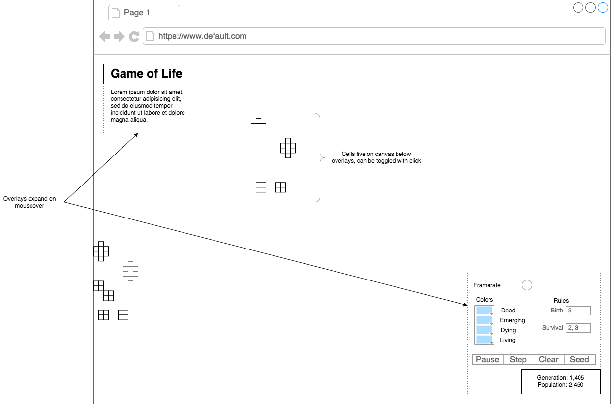

# [Conway's Game of Life](https://boothandrewd.github.io/conways-gol/)
## Background
John Conway's Game of Life is a "zero-player game" based on the following rules for a cellular automaton:

1. Any live cell with fewer than two live neighbors dies, as if caused by underpopulation.
2. Any live cell with two or three live neighbors lives on to the next generation.
3. Any live cell with more than three live neighbors dies, as if by overpopulation.
4. Any dead cell with exactly three live neighbors becomes a live cell, as if by reproduction.

Conway's Game of life is a classic example of a cellular automata, though there are countless others. Just within the variations of the rules dictated by Conway are there many interesting behaviors that can be explored.

## Functionality and MVP
This Game of Life simulator will be allow the user to:
- [ ] Start, pause, clear, and reseed the game board
- [ ] Toggle cell status in real-time
- [ ] Place pattern templates on the board in real-time
- [ ] Alter simulation parameters including:
  - [ ] Step rate
  - [ ] Seed distribution
  - [ ] Life/death rules
  - [ ] Status colors
- [ ] Production README

## Wireframes

## Architecture and Technologies
### Stack
- Frontend
  - [HTML5](https://www.w3.org/TR/html5/)
  - [CSS3](https://developer.mozilla.org/en-US/docs/Web/CSS/CSS3)
  - [Vanilla JS](http://vanilla-js.com/)
- Backend
  - [GitHub Pages](https://pages.github.com/)
- Tools
  - [Babel](https://babeljs.io/)
  - [webpack](https://webpack.github.io/)
  - [Sass](http://sass-lang.com/)

### Architecture
`entry.js` will serve as the entry point for webpack, and will mount the simulation through the `DOMContentLoaded` event handler.

`engine.js` will provide objects with a common interface to retrieve data about the simulation, including framerate, framecount, input events, etc., and will run registered engine objects through the update and draw loops.

`engine_object.js` will act as a superclass to objects that need to interact with the engine, most importantly `Cell` objects.

`cell.js` will contain all the logic necessary for rendering a single cell of the automata, including keeping neighbor references, life-status, and overriding update & draw methods.

`grid.js` will serve as the matrix management interface. Cells will have a reference to their grid in order to gain access to their neighbors.

`interface.js` will provide logic and event handlers for the user interface, informing the engine/grid of simulation parameter changes.

## Implementation Timeline
__Day 1__: Rearrange file tree. Allow basic user interactions like cell status toggling and play/pause/clear/reseed. This may be tricky because of the way drag was implemented.

__Day 2__: Add more advanced simulation interactions including the ability to control step rate, status colors, and life/death rules.

__Day 3__: Add pattern template insertion.

__Day 4__: Add more patterns. Clean up interface and provide more informational content for settings.

__Day 5__: Optimize simulation.

## Bonus Features
- [ ] Online mode: Hook into websocket backend to sync up interactions between users in real-time
- [ ] Add other types of grid-based automata such as cyclic automata, color based cells.
